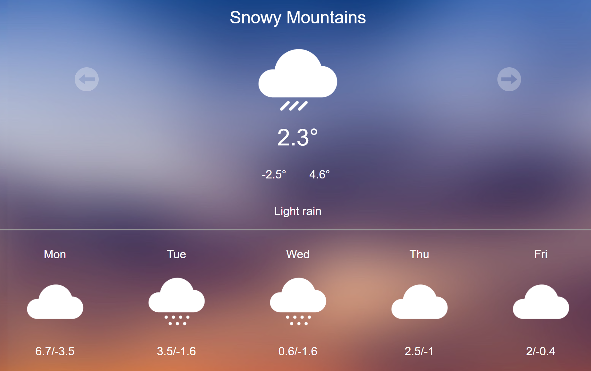

# Aussie Weather App
Weather Forcasting Application that shows the 5 days weather forcast of
4 different cities of Australia: Sydney, Brisbane, Melbourne and Snowy Mountains.

## How to run the application

1. Clone the project or download the zip file. 
2. Open the terminal in VSCode and run the command "npm install".
3. After the installation is complete, run the command "npm start"
3. The application will be opened in **localhost:3000**.
